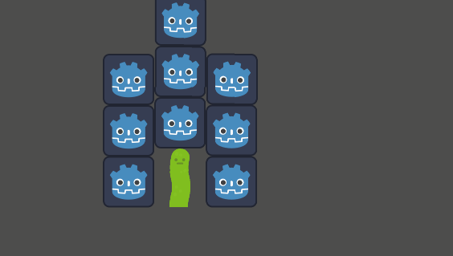
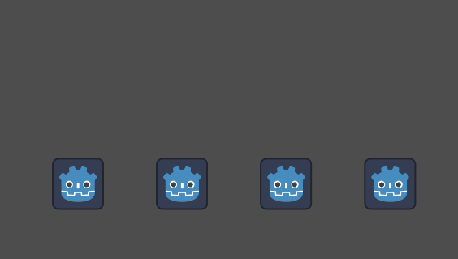

I implemented polygon-based destruction in Godot 4.6.3.

The polygon sizes are automatically determined based on the loaded image texture.

The number of subdivisions can be configured via the Inspector.

Polygon subdivision method:

1. Generate random seed points.

2. Assign grid points to the nearest seed point.
3. Enclose them using `convex_hull()`.

I am consulting with AI regarding the subdivision method.

Godot4.6.3でポリゴンの破壊を作りました。

読み込んだ画像テクスチャーから自動でポリゴンのサイズを決定します。

分割数はインスペクタから設定できます。

ポリゴンの分割方法

1. ランダムな母点を置く

2. 格子点を一番近い母点へ振り分ける
3. `convex_hull()`で囲む

分割方法に関してはAIと相談しています

ASSET

https://kenney.nl/
